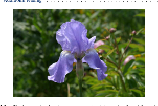
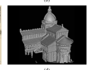
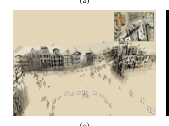
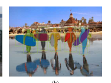

# 🚀 Computer Vision-Based Image Extraction from PDF


---

## 📌 Overview

This project extracts **images, figures, and diagrams from PDF documents** using Computer Vision techniques.

Unlike traditional methods, it:
- Detects visual elements directly from rendered pages  
- Extracts diagrams, charts, and illustrations  
- Saves them as separate image files  

---

## ❓ Problem Statement

PDF documents contain:
- Embedded images  
- Charts and diagrams  
- Complex layouts  

Challenges:
- Traditional tools miss non-embedded visuals  
- Manual extraction is slow  
- No automation for bulk processing  

---

## 🎯 Objective

Automate visual content extraction:

**PDF → Page Image → Detect Figures → Extract → Save**

---

## 🧠 Algorithm & Processing Flow

### Pipeline:
PDF → Image → Grayscale → Threshold → Contours → Filter → Crop → Save  

---

### 🔹 Step 1: Original Image (Input)

- PDF page converted into image using PyMuPDF  


---

### 🔹 Step 2: Binary Image (After Thresholding)

- Convert to grayscale  
- Apply binary threshold  


---

### 🔹 Step 3: Contour Detection

- Detect figure boundaries using OpenCV  
- Draw bounding boxes  


---

### 🔹 Step 4: Filtering & Cropping

- Remove small contours (noise)  
- Expand bounding box slightly  
- Crop detected figures  

---

### 🔹 Step 5: Save Output

- Save extracted figures as:
- pageX_figureY.png


---

## 📂 Project Structure
```
CV
│
├── Images
│ ├── Original Image.png
│ ├── Binary Image.jpg
│ └── Output Contours.png
│
├── Results
│ ├── Final Output Folder.png
│ ├── page1_figure1.png
│ ├── page2_figure1.png
│ ├── page2_figure2.png
│ └── page2_figure3.png
│
├── Book Sample.pdf
├── Computer Vision based Image Extraction.py
└── README.md
```

---

## 🖼️ Results

### 📁 Final Output Folder


---

### 📸 Extracted Figures

<table>
<tr>
<td align="center">

</td>
<td align="center">

</td>
</tr>

<tr>
<td align="center">

</td>
<td align="center">

</td>
</tr>
</table>

---

## 📦 Tech Stack

- Python  
- PyMuPDF (fitz)  
- OpenCV (cv2)  
- NumPy  
- Pillow (PIL)  

---

## 🔍 Use Cases

- Extract figures from research papers  
- Automate dataset creation  
- Document analysis  
- Preprocessing for ML/CV  

---

## ⚠️ Limitations

- Fixed threshold (not adaptive)  
- May detect unwanted regions  
- No classification of figures  

---

## 🔮 Future Work

- Adaptive thresholding  
- Deep learning-based detection  
- GUI interface  
- Figure classification  

---

## 🏁 Conclusion

This project provides an automated and efficient way to extract visual content from PDFs using Computer Vision, significantly reducing manual effort.

---

## 👨‍💻 Author

Academic Project  
Focus: Computer Vision + Image Processing
